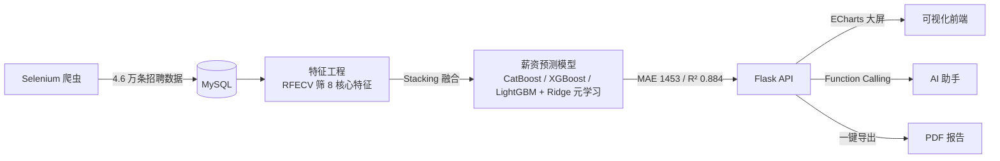

# salary-prediction · Showcase

> 🔒 **Private core, public showcase.** 本仓库为「大数据岗位薪资分析预测系统」的展示型仓库。核心源码为私有，不在此公开。这里只展示方法论、关键指标与可体验入口，用于求职与技术交流。

---

## 大数据岗位薪资分析预测系统

一个端到端的数据科学项目：自动爬取招聘数据 → 清洗建模 → 融合模型预测薪资 → 可视化大屏 + AI 助手 + PDF 报告。面向求职者预测目标岗位薪资区间，2026.03 – 2026.04 独立开发。

## 关键指标

| 指标 | 数值 |
|---|---|
| 数据规模 | 46,000 条有效招聘数据（Selenium 爬取） |
| 预测误差 | **MAE 1,453 元** |
| 拟合优度 | **R² 0.884** |
| 相对基准 | MAE 较 Ridge 基准降低 **77.3%** |
| 技术栈 | Python · Flask · MySQL · ECharts |
| AI 能力 | Function Calling 助手 + PDF 报告导出 |

## 方法论概览

## 技术亮点

- **Stacking 多模型融合**：CatBoost + XGBoost + LightGBM 融合，Ridge 元学习，兼顾类别特征与梯度提升，MAE 低至 1,453 元，较 Ridge 基准降低 77.3%。
- **特征选择**：RFECV 递归特征消除筛选 8 个核心特征，降维去噪。
- **可视化大屏**：ECharts 交互式看板，支持多维筛选与下钻。
- **AI 助手（Function Calling）**：用户可用自然语言追问，助手调用工具取数作答。
- **PDF 报告导出**：一键生成带图表的分析报告。

## 截图与 Demo

> 放入 `assets/`（截图均带 `© 赵文涛 2026` 水印）：
> - `assets/dashboard.png` — 可视化大屏
> - `assets/report.png` — PDF 报告样例
> - `assets/demo.mp4` — 系统演示

## 本仓库不包含（刻意保留为私有）

- 完整源码与私有仓库
- Selenium 爬虫脚本（涉及招聘站点 ToS，不对公开源）
- 数据库结构与原始数据集
- 模型权重与完整训练 pipeline
- API Key 与线上配置

---

© 2026 赵文涛 · [GitHub](https://github.com/ZhaowTao) · [作品集](https://zhaowtao.github.io/grz/)
